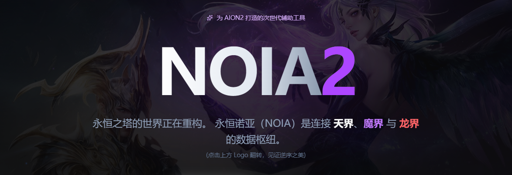

# NOIA2 - 永恒之塔2 次世代辅助工具

<p align="center">
  
</p>

<p align="center">
  <strong>为 AION2 玩家打造的数据分析与战斗辅助平台</strong>
  <br>
  实时战斗分析 · 角色评分 · BD模拟器 · 零延迟数据同步
</p>

## 📖 1. 项目简介

**NOIA2** 是一个开源、免费的《永恒之塔2》（AION2）辅助工具集。它通过实时抓取游戏数据，为玩家提供战斗分析（DPS Meter）、角色属性评分、BD模拟器等功能，帮助玩家优化输出、提升角色实力。

**交流群QQ：1082705131**

> ⚠️ 本项目为玩家社区作品，**不隶属于 NCSOFT**，不涉及任何游戏客户端修改，仅基于游戏公开数据进行解析与展示。

## ✨ 2. 功能特性

### ⚔️ 战斗分析 (DPS Meter)

- 实时追踪团队成员的输出数据（DPS/HPS）
- 深度解析技能循环、爆发时机、增益覆盖率
- 支持战斗回放与数据导出（JSON/CSV）

### 📊 角色评分

- 一键查询角色攻击力、伤害增幅、暴击等核心属性
- 基于装备、Buff、宠物盘的动态综合评分
- 属性阈值对比，提供个性化养成建议

### 🛠️ BD 模拟器 (开发中)

- 自由搭配装备、宠物盘、技能符文
- 实时预览属性变化与套装效果
- 支持配置导入/导出，方便分享与对比

### 📈 其他功能（开发中）

- 属性收益分析，对比不同属性带来的伤害提升；
- 游戏内查分（查询队友）

## 🚀 3. 开始使用

**下载安装：** 请在右侧release中下载最新版本，按照提示进行安装即可。如果安装有问题，请通过管理员方式运行安装包，或者在安装时选择重新安装并且清空app data。

**DPS水表（重要！）：** 运行程序后，会自动打开DPS水表页面，点击左上方的启动按钮，等待服务启动后（3秒左右），指示灯标变绿。在战斗前，请使用默认快捷键`Alt+Q`清空水表统计，可以在设置中进行修改快捷键设定。

**其他功能：** 在主程序上方的导航中使用其他功能。

更多问题可以下翻查看FQA或者查看Issues。

## 4. 项目架构

NOIA2 采用混合架构，结合了现代前端技术与高性能后端：

- **前端界面**：React + TypeScript 构建用户界面，通过 Tauri 提供的 API 与底层通信。
- **Tauri 核心**：Rust 编写的轻量级应用容器，负责窗口管理、系统菜单、安全隔离以及调用 Python 后端。
- **Python 后端**：独立进程，负责游戏数据抓取、日志解析、复杂的计算逻辑（如 DPS 分析、角色评分算法）。通过WebSocket和前端进行双向通信。

这种设计保证了前端的流畅体验，同时充分利用 Python 在数据分析领域的生态优势。

## 5. 本地部署 （开发者）

### 环境要求

- Node.js 16+
- Rust 和 Cargo (安装 Tauri 所需)
- Python 3.9+
- npm 或 yarn

### 安装步骤

1. **克隆仓库**

   ```bash
   git clone https://github.com/zdyoung0519/noia2.git
   cd noia2
   ```

2. **安装前端依赖**

   ```bash
   npm install
   ```

3. **安装并构建Python 依赖**

   ```bash
   pip install -r ./src-python/requirements.txt
   python build_python.py
   ```

4. **启动开发服务器（前端 + Tauri）**

   ```bash
   npm run tauri dev
   ```

5. **构建生产版本**
   ```bash
   npm run tauri build
   ```

## ❓6. FAQ

### DPS水表相关

**Q: 它与其他DPS计量表有什么不同？**

这个版本基于`TK-open-public/Aion2-Dps-Meter`进行了完全重构，使用python作为后端抓包，前端用React+Tauri打包，大幅度缩短了软件包体积（<20MB）和运行时内存占用。

**Q: 为什么无法显示DPS统计数据？**

1. 请检查电脑已经下载了[NpCap](https://npcap.com/#download)，并且按照默认配置进行安装。
2. 运行程序后会自动弹出dps水表窗口，请点击**启动**按钮来确保抓包服务已经启动，注意启动约有3秒左右延迟，**不要重复点击**，成功启动后指示灯会**变绿**。
3. 在游戏内进行造成伤害会产生正确的记录。
4. 如果仍然没有数据，可能为Npcap问题或者加速器问题，**向我反馈并等待后续版本修复更新**。

**Q: 玩家名称是数字，并且无法识别我的角色**

- 请切换地图进行刷新；
- 由于抓包问题，刷新地图有时候也很难获取正确的名称，请理解

**Q: DPS列表中玩家过多**

- 默认在所有状态下开启了dps统计；并且默认统计了所有的伤害记录（包括怪物，带有mod标识
- 可以在设置中修改最大显示数目，以及是否统计怪物。

**Q: 如何清空DPS列表.**

- 点击工具中的重置按钮，或者使用快捷键（Alt+Q），在设置中可以修改快捷键；
- 再次造成伤害记录后会自动开始新的统计；

**Q: 其他已知问题.**

- 召唤物和召唤者没有正确匹配，包括精灵的召唤物和奶妈的神圣气息；
- 魔道星的伤害统计似乎缺少很多（本人没有魔道的角色，后续慢慢修复）；
- 相比于收费水表存在统计缺失，属于抓包的固有缺陷，暂时难以解决；
- 技能图标不完整：后续会修复，并完善技能统计的显示ui。

### 角色查分相关

**Q: 它与蜂窝有什么相同和不同？**

- 【查分接口】与蜂窝相同，均通过**官方API接口**进行角色装备的获取，目前只能获取装备、卡牌、称号；无法获取万神殿、宠物、外观等收集内容；
- 【评分方式】根据**伤害计算公式**进行计算评分，属性分析工具完全**免费、公开、透明**；
- 【现代化UI风格】更加贴近游戏内的UI设计和计算逻辑。
- 【开源和兼容】完全开源，后续兼容蜂窝评分。

**Q: 为什么无法查看排行榜？如何加入排行榜？**

- 请先确保已经注册并登陆了NOIA2，才可以查看排行榜的数据；
- 加入排行榜同样需要注册和登录，在完成登陆后，请点击角色页右上方的刷新以提交至排行榜。
- 登录、注册、以及数据库等功能，基于免费的数据库服务（supabase）搭建，可能存在延迟，加载有误等问题；基础的角色查分功能不受影响。

## 🤝 7. 贡献指南

欢迎任何形式的贡献！无论是新功能、Bug 修复、文档改进还是问题反馈。

1. Fork 本仓库
2. 创建你的特性分支 (`git checkout -b feature/AmazingFeature`)
3. 提交你的修改 (`git commit -m 'Add some AmazingFeature'`)
4. 推送到分支 (`git push origin feature/AmazingFeature`)
5. 打开一个 Pull Request

请确保代码风格保持一致，并遵循项目的 ESLint 配置。对于 Python 部分，请遵循 PEP 8 规范。

## 📄 8. 许可证

本项目基于 **GNU General Public License v3.0** 协议开源，详情请参阅 [LICENSE](LICENSE) 文件。

## 📬 9. 联系我们

- 项目主页: [https://github.com/zdyoung0519/noia2](https://github.com/zdyoung0519/noia2)
- 问题反馈: [Issues](https://github.com/zdyoung0519/noia2/issues)
- 讨论区: [Discussions](https://github.com/zdyoung0519/noia2/discussions)

<p align="center">
  <sub>Made with ❤️ by NOIA2 Team</sub>
  <br>
  <sub>NOIA2 is a trademark of NCSOFT Corporation. This project is not affiliated with NCSOFT.</sub>
</p>
