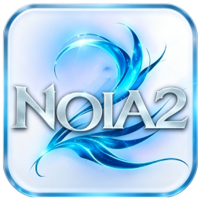
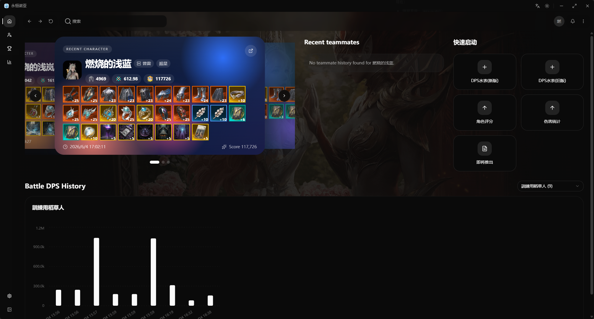
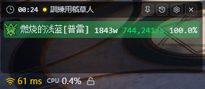
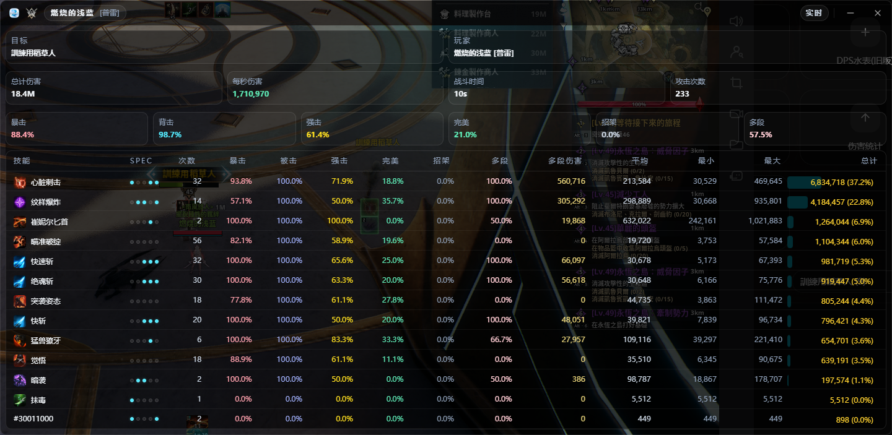
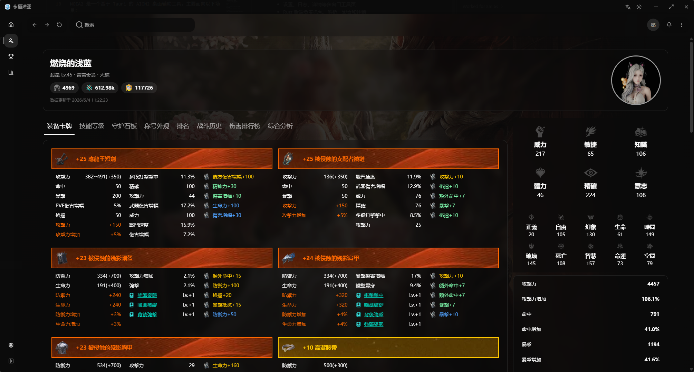
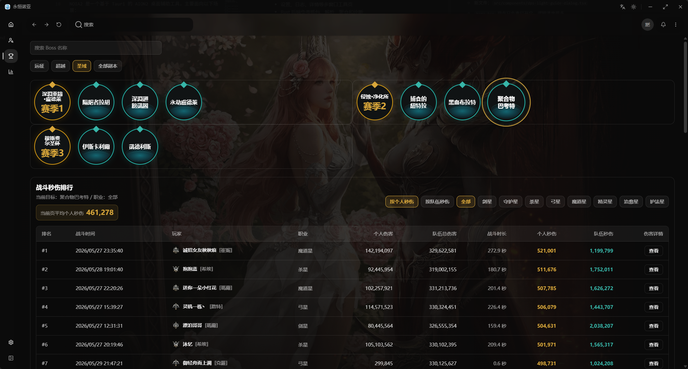
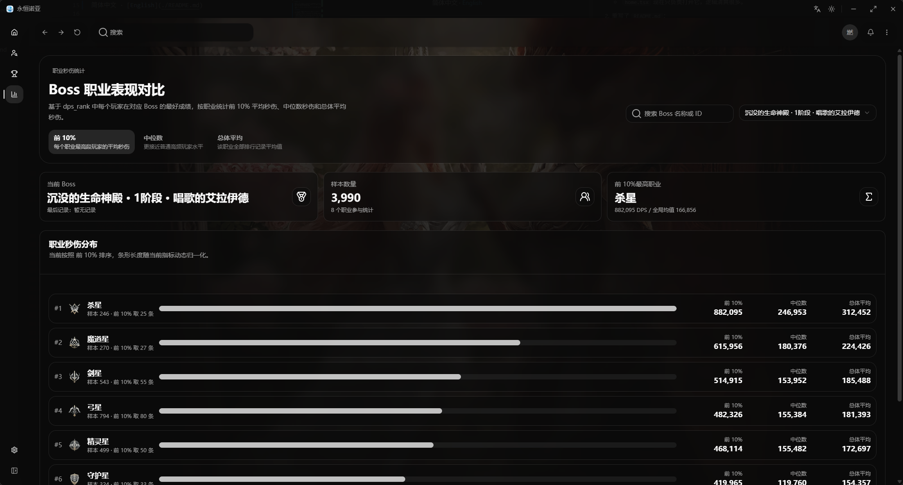
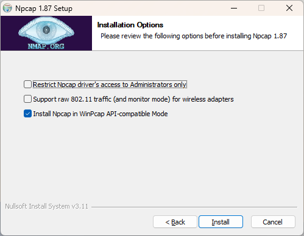
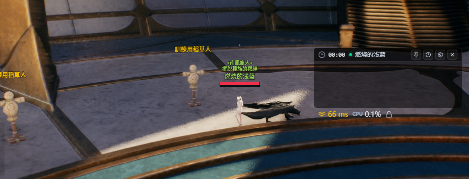
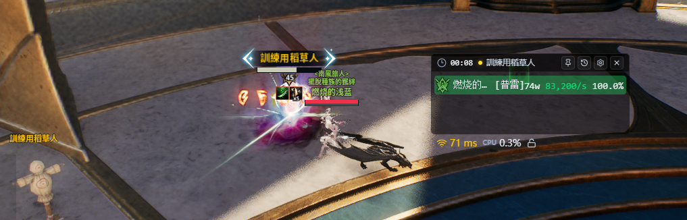

<div align="center">



# NOIA2

An elegant desktop companion for AION2 players, built around a lightweight real-time DPS overlay, battle history, rankings, and multi-window combat analysis.

[](https://tauri.app/)
[](https://react.dev/)
[](https://www.typescriptlang.org/)
[](https://www.rust-lang.org/)
[](./LICENSE)

[简体中文](./README.zh-CN.md) · English

</div>

---

## What Is NOIA2?

NOIA2 is a Windows desktop toolkit for AION2. It combines a Rust packet-capture backend with a polished Tauri + React interface, giving players a fast floating DPS meter, historical battle review, detail popups, and practical combat diagnostics without a heavy in-game UI.

The project is designed for day-to-day play: open the meter, switch back to the game, and let the overlay follow your combat flow.

## Highlights

- **Lightweight floating DPS overlay** with two visual styles: Hunter Compact and Classic Bars.
- **Real-time latency footer** with ping, CPU, memory, click-through lock, and ping history chart.
- **Battle history and detail views** for reviewing target damage, skill breakdowns, and player contributions.
- **Home dashboard** for recent characters, teammates, and battle target trends.
- **Character scoring tools** for browsing equipment, stats, growth direction, and overall character strength.
- **Damage rankings** for comparing personal and party performance across recorded encounters.
- **Class statistics** for understanding class-level DPS distribution and combat trends.
- **Multi-window workflow** for DPS, detail, settings, logs, guide dialog, and focused overlays.
- **Rust capture pipeline** for packet capture, parsing, aggregation, diagnostics, and storage.
- **User-tunable appearance** including opacity, scale, colors, nickname masking, target HP display, and class icon style.
- **Global shortcuts, tray behavior, updater flow, and localization** built into the desktop app.

## Preview

### Home Dashboard



### Lightweight DPS Overlay



### DPS Detail View



### Character Score



### DPS Rankings



### Class Statistics



## Quick Start

### Requirements

- Windows
- Node.js 18+
- pnpm 9+
- Rust toolchain
- Npcap for packet capture

### Install Dependencies

```bash
pnpm install
```

### Run In Development

```bash
pnpm tauri:dev
```

### Build Installer

```bash
pnpm tauri:build
```

## Usage Guide

NOIA2 includes a built-in guide when you open the lightweight DPS meter. The flow is:

1. Install Npcap and keep the WinPcap-compatible option enabled.
2. Enter the game and teleport once so NOIA2 can identify your character.
3. Start fighting in a training or dungeon scenario. DPS data appears automatically.

<p align="center">
  
  
  
</p>

## Feature Tour

| Area | What It Does |
| --- | --- |
| DPS Overlay | Shows live damage, DPS, contribution percentage, class icon, server tag, and target timer. |
| Ping Footer | Shows latency, CPU, memory, and a lock button for click-through overlay mode. |
| Detail Window | Opens skill and player details without interrupting the main overlay. |
| History | Saves battle snapshots locally and supports later review and upload status tracking. |
| Character Score | Helps inspect character equipment, stats, and progression strength in a dedicated rating page. |
| Rankings | Provides damage ranking views, personal DPS comparison, and party performance review. |
| Class Statistics | Summarizes class-level combat trends so players can compare DPS distribution by class. |
| Settings | Controls overlay style, scale, opacity, colors, shortcuts, and backend capture behavior. |

## Architecture

```text
NOIA2
├─ src/                     React + TypeScript frontend
│  ├─ components/           UI, dashboard, DPS panels, guide dialog
│  ├─ hooks/                settings, translation, updater, user state
│  ├─ lib/                  window helpers, storage, uploads, AION2 utilities
│  ├─ pages/                multi-window routes
│  └─ types/                shared frontend types
├─ src-tauri/               Tauri v2 desktop shell and Rust backend
│  ├─ src/dps_meter/        capture, parsing, calculator, models, storage
│  ├─ src/plugins/          tray, focus tracking, window tracking, HTTP helpers
│  └─ tauri.conf.json       desktop configuration
├─ public/                  app images, guide images, class/skill assets
├─ docs/                    updater, shortcut, and i18n docs
└─ screenshots/             legacy screenshots
```

## Scripts

```bash
pnpm dev              # Start Vite only
pnpm tauri:dev        # Start the desktop app in development
pnpm build            # Type-check and build frontend
pnpm tauri:build      # Build Windows installer
pnpm lint             # Run ESLint
pnpm format           # Format source files
pnpm check            # Format check, lint, and full build
```

## Release Flow

```bash
pnpm release:version
```

The release script checks repository state, validates version consistency, creates the release commit, and tags the build. GitHub Actions can then produce installer and updater artifacts from release tags.

## Notes

- The current capture workflow is tuned for Windows desktop usage.
- Npcap is required for packet capture.
- Some data is intentionally displayed transparently, including unknown actors or distant summon-related entries, so users can see what the parser actually observes.
- Local storage is used for UI settings, recent character history, and DPS history.

## Documentation

- [Auto Update](./docs/AUTO_UPDATE.md)
- [Global Shortcut](./docs/GLOBAL_SHORTCUT.md)
- [I18N](./docs/I18N.md)

## License

MIT. See [LICENSE](./LICENSE).
