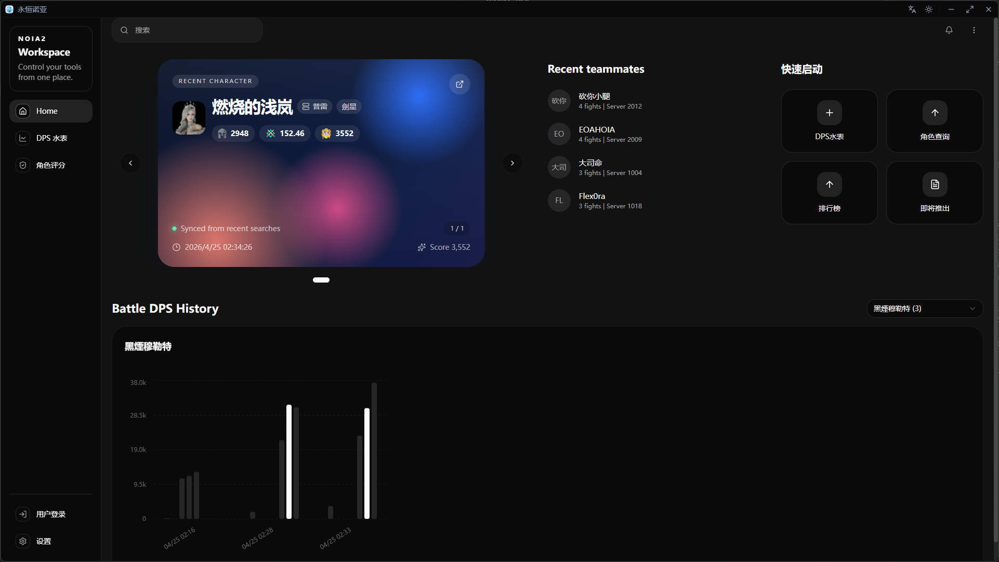
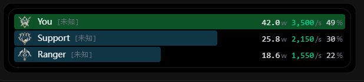

<div align="center">

# NOIA2

简体中文 | [English](./README.md)

[](https://tauri.app/)
[](https://react.dev/)
[](https://www.typescriptlang.org/)
[](./LICENSE)

一个面向永恒之塔 2 的桌面工具，包含悬浮 DPS、水表历史、多窗口辅助和 Rust 后端解析能力。

</div>

## 项目简介

NOIA2 是一个基于 Tauri 的 AION2 桌面辅助工具，主要面向以下场景：

- 悬浮 DPS 统计
- 战斗详情和历史查看
- 首页角色、队友、目标历史面板
- 设置、日志、详情等多窗口工具页
- Rust 后端负责抓包、解析、聚合和诊断

## 预览

主页



DPS 悬浮窗:



DPS 技能窗:


## 功能特性

- 支持悬浮 DPS 窗口，自定义颜色、透明度、缩放和昵称打码
- 支持 `main`、`dps`、`dps_detail`、`dps_log`、设置页等多窗口协作
- Rust 实现实时战斗快照、聚合和诊断链路
- 本地历史存储与设置管理，内置存储占用查看与清理
- 支持全局快捷键、托盘、自动更新和自定义标题栏
- 首页展示最近角色、最近队友、战斗目标 DPS 历史
- 支持英文、简体中文、繁体中文、韩文 UI 国际化

## 技术栈

- 桌面框架：[Tauri v2](https://tauri.app/)
- 前端：[React 19](https://react.dev/) + [TypeScript](https://www.typescriptlang.org/)
- 构建工具：[Vite](https://vite.dev/)
- UI：[shadcn/ui](https://ui.shadcn.com/) + [Tailwind CSS v4](https://tailwindcss.com/)
- 国际化：[i18next](https://www.i18next.com/)
- 图表：[Recharts](https://recharts.org/)
- 后端：Rust

## 环境要求

- Node.js 18+
- pnpm 9+
- Rust toolchain
- Windows 环境
- 已安装 Npcap，用于抓包

## 快速开始

### 安装依赖

```bash
pnpm install
```

### 开发模式

```bash
pnpm tauri dev
```

### 生产构建

```bash
pnpm tauri build
```

## 常用脚本

```bash
pnpm dev
pnpm build
pnpm tauri:dev
pnpm tauri:build
pnpm lint
pnpm lint:fix
pnpm format
pnpm format:check
pnpm check
```

## 发版流程

项目使用下面的命令进行版本发布：

```bash
pnpm release:version
```

这个脚本会自动完成：

- 检查工作区是否干净
- 要求当前分支为 `main`
- 校验前端与 Tauri 版本号是否一致
- 创建发布提交和对应的 `vX.Y.Z` tag
- 可选地推送分支与标签

之后 GitHub Actions 会根据发布标签构建安装包和自动更新文件。

## 目录结构

```text
.
├─ src/
│  ├─ components/
│  │  ├─ dps/
│  │  └─ ui/
│  ├─ hooks/
│  ├─ i18n/
│  ├─ lib/
│  ├─ pages/
│  │  ├─ home.tsx
│  │  ├─ dps.tsx
│  │  ├─ dps_detail.tsx
│  │  ├─ dps_log.tsx
│  │  ├─ settings.tsx
│  │  └─ settings_view.tsx
│  └─ types/
├─ src-tauri/
│  ├─ src/
│  │  ├─ dps_meter/
│  │  │  ├─ api/
│  │  │  ├─ capture/
│  │  │  ├─ engine/
│  │  │  ├─ models/
│  │  │  └─ storage/
│  │  └─ plugins/
│  └─ tauri.conf.json
├─ src-python/
├─ docs/
├─ public/
└─ screenshots/
```

## 相关文档

- [自动更新](./docs/AUTO_UPDATE.zh-CN.md)
- [全局快捷键](./docs/GLOBAL_SHORTCUT.zh-CN.md)
- [国际化](./docs/I18N.zh-CN.md)

## 补充说明

- 当前抓包和检测链路主要面向 Windows 桌面环境。
- `src-python/` 中保留了一部分旧版 Python 解析实现，主要作为参考。
- 项目使用 localStorage 保存 UI 设置、主角色历史和 DPS 历史。

## License

MIT
